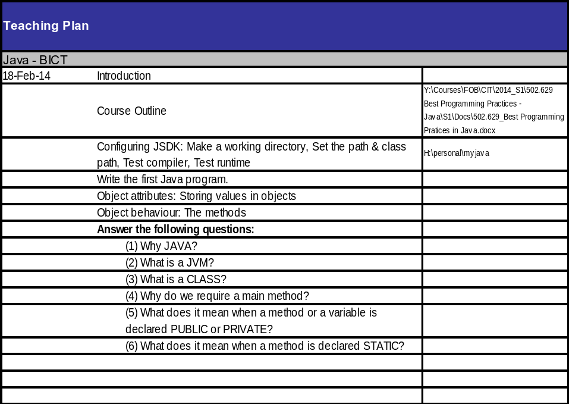
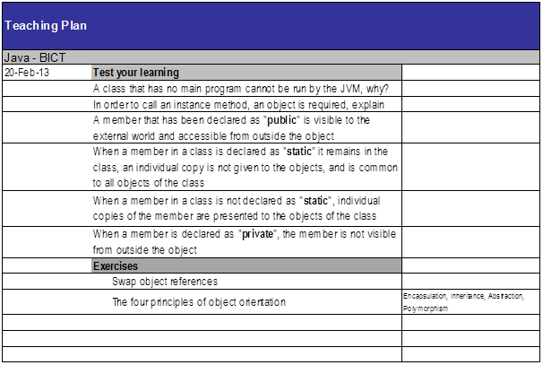
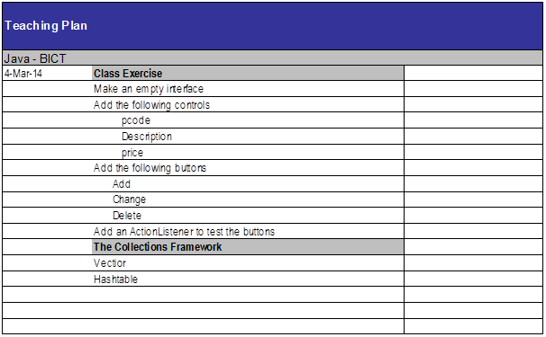
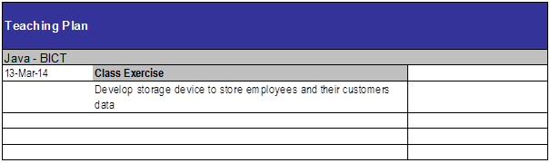
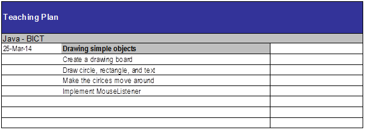
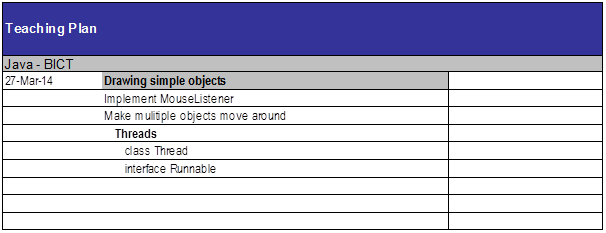
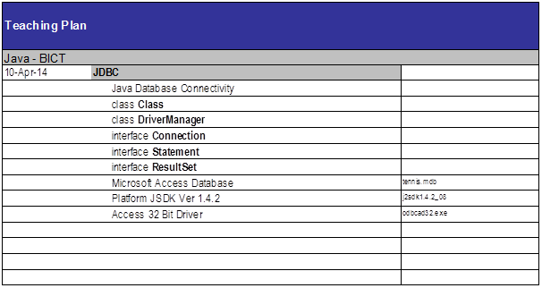

Java
####

18/02/2014
==========



Week 1 Configuration:
---------------------
* Created a directory in my H: drive to store java code
  (``H:\java_course\java_code``).
* Added myconfig.bat into java_code, with the following environment variable
  configuration lines:

  * ``set path="C:\Program Files\Java\jdk1.7.0_45\bin"``
    * Which adds the java executables to the system path.
  * ``set classpath=h:\java_course\java_code``
    * Which sets my java code directory to the directory where java classes
      should be created.

* To test:

  * Run: ``cmd``
  * Move to H:\ drive (by running ``h:``)
  * Move to java_code (by running ``cd java_course\java_code``)
  * Run ``javac``
    * Confirm it cannot be found
  * Run ``myconfigb.bat``
  * Run ``javac``
    * Confirm usage is displayed, because we didn’t provide a java code file.

``javac`` compiles java source files (``.java``), and ``java`` runs java class
files (``.class``).

javac may encounter compilation errors, java runtime may encounter logic errors.

Java **keywords** are all **lowercase**.

**Standard**: All class names are upper camel case.`

No members should be outside a class; no code should be outside of methods.

UML
---

* Classes are rectangles with names on top; top division containing attributes,
  and bottom division containing behaviours.
* Attributes contain values or addresses (obj refs)
* Behaviours are methods containing code.

First program
-------------

::

   class Employee {
     public static void main(String[] args) {
       Employee emp = new Employee();
       emp.print();
     }

     public void print() {
       System.out.println("Hello World!");
     }
   }

* Put the code in ``ben1.java``
* Run ``javac ben1.java`` to compile the class in the file.
* Then, ``Employee.class`` has been created, so we can run ``java Employee`` to
  run the class with the java runtime (which invokes the main() method)
* **Explanation**:

  * ``Employee`` class containing a main method
  * ``main()`` must be:

    * **public** so it can be invoked from outside the class
    * **static** so that it does not need to be called on an instance
    * **void** because it returns nothing
    * and it must accept an array of strings (``String[] args``), which are the
      command line arguments.

  * We then use the System.out.println() method to print text to the console.
  * Making syntax errors will cause ``javac`` to complain (e.g. remove
    semi-colon)
  * Trying to call a non-static member from a static member will cause a
    compilation error, because the static member is not associated with an
    instance to call the non-static member on.
  * ``Employee emp = new Employee()`` explained

    * Declare a new variable in the stack (``emp``) to store a reference (memory
      address) to an Employee object.
    * Create a new ``Employee`` object in the heap, passing nothing to the
      constructor.
    * Assign (with =) the memory address of the new Employee to the emp
      variable.
    * The variable ``emp`` can now be used to reference the ``Employee`` object.

Question answers:
----------

1) Java is cross-platform, and strongly typed, which is useful for certain applications.
2) JVM = Java Virtual Machine: The runtime environment for compiled java code to run on any
   OS.
3) A class is a template for creating objects.
4) A class's main method is invoked when the class is run with ``java`` from the command
   line. Without a main method, a class cannot be run as a program.

20/02/2014
==========



Download Netbeans:
------------------
http://www.oracle.com/technetwork/java/javase/downloads/jdk-7-netbeans-download-432126.html

Diagram
-------

Tester
+----------+
|          |
+----------+
|C+main(..)|
+----------+

Employee
+----------+
|          |
+----------+
|+pay()    |
|+work()   |
|-eat()    |
|+workPay()|
+----------+

Staff
+----------+
|          |
+----------+
|+work()   |
|+jobWork()|
+----------+


Manager
+----------+
|          |
+----------+
|          |
+----------+

::

  class Tester {
      public static void main(String[] args) {
	  Employee emp1 = new Manager();
	  // Employee .. work
	  emp1.work();
	  // Employee .. pay
	  emp1.pay();

	  Employee emp2 = new Staff();
	  // Employee .. pay
	  emp2.pay();
	  // Staff .. work
	  emp2.work();

	  // Causes compilation error (Private member not visible outside of class).
	  //emp1.eat();

	  // Causes compilation error (Not visible from superclass ref).
	  //emp2.jobWork();

	  // Causes compilation error (Subclass ref cannot point to superclass obj).
	  // Staff emp3 = Employee();
      }
  }

  class Employee {
      public void work() {
	  System.out.println("Employee .. work");
      }

      public void pay() {
	  System.out.println("Employee .. pay");
      }

      private void eat() {
	  System.out.println("Employee .. eat");
      }

      public void workPay() {
	  System.out.println("Employee .. workPay");
	  work();
	  pay();
      }
  }

  class Staff extends Employee {
      public void work() {
	  System.out.println("Staff .. work");
      }

      public void jobWork() {
	  System.out.println("Staff .. jobWork");
      }
  }

  class Manager extends Employee {

  }

Application Development
  Creating an executable class with a main method; makes use of object libraries.

Object Engineering
  Creating classes that will be used to create objects in applications and other classes.

When a class is loaded from the disk into memory, only static methods are stored as part of
the class. Instance methods are stored with context as part of each instance.

When accessing an instance member from within an instance method, the keyword ``this`` can
ben used to access the current instance. If there is no name conflict, this can even be
omitted, and the member accessed directly (as showing in ``Employee.workPay()``)

OOP
---

Inheritance
  "Is-a" relationship. Closed, empty arrow pointing toward superclass in UML.

An object-reference of a parent type can point to an instance of child type, but only the
parent's members will be accessible. Try to use parent object-references as much as
possible.

An object-reference of child type cannot point towards an object of parent type, because
it will not be able to fulfil the specialised role.

In an OO-inheritance hierarchy, **specialization** is downward, **generalization** is
upward.

Even if a child class is empty, it can still be used in the same way as it's parent.

A private member cannot be accessed from outside of the same class (not even in child
classes).

25/02/2014
==========

.. image:: images/week2_1png

::

  class Employee {

      public int ecode;
      public String fname;
      public String lname;
      public double salary;

      public Employee(int ecode, String fname, String lname, double salary) {
	  System.out.println("Employee .. constructor");
	  this.ecode = ecode;
	  this.fname = fname;
	  this.lname = lname;
	  this.salary = salary;
      }

      public void pay() {
	  System.out.println("Employee .. pay");
      }

      public String work() {
	  System.out.println("Employee .. work");
	  return ecode + ": " + fname + " " + lname + "\nSalary: $" + salary;
      }

  }

  class Staff extends Employee {

      public Staff(int ecode, String fname, String lname, double salary) {
	  super(ecode, fname, lname, salary);
	  System.out.println("Staff .. constructor");
      }

      // Note how this method overrides work() in Employee for Staff objects.
      public String work() {
	  System.out.println("Staff .. work");
	  return ecode + ": " + lname + ", " + fname + "\nSalary: $" + salary;
      }

  }

  class Manager extends Employee {

      public Manager(int ecode, String fname, String lname, double salary) {
	  super(ecode, fname, lname, salary);
	  System.out.println("Manager .. constructor");
      }

  }

  class Tester {
      public static void main(String[] args) {
	  // Prints "Employee .. constructor" and "Staff .. constructor", as the constructor
	  // is fired.
	  Employee emp = new Staff(1001, "Ben", "Denham", 120000);
	  testEmp(emp);

	  // Prints "Employee .. constructor" and "Manager .. constructor", as the constructor
	  // is fired.
	  Employee mgr = new Manager(1001, "Ben", "Denham", 120000);
	  testEmp(mgr);
      }

      public static void testEmp(Employee emp) {
	  // Prints "{Class} .. work" as work() is fired. Also returns the employee
	  // description, which we store in our local String variable: fullName.
	  String description = emp.work();
	  // Prints the description that we stored in the last line.
	  System.out.println(description);
      }
  }


In Java, attributes are declared in a class with the following syntax::

  [public|private] type attributeName;

Constructors
------------

A special method that is automatically run when an instance of a class is created.

Constructors are useful for initializing variables, and for initializing other required
context (e.g. database connections).

The constructor must be public, must have no return value, and must have the same name as
the class.

Note how we pass arguments to the constructor when initializing an object with ``new`` (see
``Tester.main()``).

Method arguments and return values
----------------------------------

Note how Employee.work() returns a ``String`` instead of ``void``, by declaring the return
type and by using the ``return`` keyword.

We must return a value that matches the specified return data type (String).

Note how in the constructor of Employee, we accepted arguments by specifying the data type
and variable name of each argument.

Note: Because these local variables (fname, lname) conflict with the instance variables of
the same names, the local variables take preference when being referenced, and the instance
variables must be referenced with ``this``. When there is no conflict, instance variables
can be referenced without ``this``.

When an object reference is created of a reference type (E.g. String or another class), the
default value is null. (Primitive types have a default value, such as 0 for number types.)

Local and Instance variables
----------------------------

When local variables conflict with instance variables of the same names, the local
variables take preference when being referenced, and the instance variables must be
referenced with ``this``. When there is no conflict, instance variables can be referenced
without ``this``.

* A local variable is allocated when a method runs, and becomes innaccessible when the method
  finishes.
* An instance variable is allocated when an object is created, and becomes innaccessible when
  the object becomes innaccessible.
* A static variable is allocated when the class is loaded into memory, and becomes
  inaccessible when the class becomes innaccessible (usually when the program finishes).

Overriding
----------

When we declare a method in a class that has already been declared in a parent class with
the same signature (method name and arguments types and order), then that method is said to
**override** the method in the parent class.

Whenever the method is called for an object of the child type (even when the object reference is of parent type), the overriding definition is used instead of the original one.

27/02/2014
==========

``javap class_name`` inspects a class.

Assignment
----------

1. UI
2. Vector
3. Hashtable

Java UI
--------

Earliest form: AWT. AWT had classes for ``Frame``, ``Textfield``,`` Button``,
etc. Problem: the screens were not as good as VB user interfaces.
Namespace: ``java.awt``

Swing extends AWT (through inheritance). Swing classes always start with "J" (e.g.
``JFrame``, ``JButton``). Namespace: ``javax.swing``

To create our own form, we create our own class that inherits from ``JFrame``. Our
custom form will then contain other controls like buttons and textfields.

Using ``import java.awt.*`` will import all class, abstract classes, interfaces, etc.
inside ``java.awt``, but not any sub-namespaces.

Action Listening
----------------

We must have a class that implements ``ActionListener`` by including the method
``public void actionPerformed(ActionEvent ae)``. This class can be our Frame.

We must also add the instance of our ``ActionListener`` as a listener for a control. For
example, if I want the current frame I am constructing to listen to btnOkay, I use:
``btnOkay.addActionListener(this); // this is my frame that implements ActionListener``.

::
  import java.awt.*;
  import javax.swing.*;
  import java.awt.event.*;

  class MainFrame extends JFrame implements ActionListener {

      JTextField txtCustomerName;

      public MainFrame() {

	  setTitle("My First UI");
	  // Don't use any automatic layout. If we used a layout, we wouldn't need to
	  // specify all of bounds.
	  setLayout(null);
	  // Use setBounds(posX, posY, width, height) to position the Frame.
	  setBounds(10, 10, 400, 600);

	  // Create our form controls.
	  JLabel lblCustomerName = new JLabel("Customer Name");
	  txtCustomerName = new JTextField();
	  JButton btnOkay = new JButton("Okay");
	  JButton btnGet = new JButton("Get");

	  // Use setBounds(posX, posY, width, height) to position the controls.
	  lblCustomerName.setBounds(20, 20, 100, 20);
	  txtCustomerName.setBounds(120, 20, 200, 20);
	  btnOkay.setBounds(20, 60, 80, 20);
	  btnGet.setBounds(120, 60, 80, 20);

	  // Subscribe our Frame to the actions of the button.
	  btnOkay.addActionListener(this);
	  btnGet.addActionListener(this);

	  // We add the items to the container instead of this object in order to avoid
	  // conflicts with the JFrame superclass?
	  Container con = getContentPane();
	  con.add(lblCustomerName);
	  con.add(txtCustomerName);
	  con.add(btnOkay);
	  con.add(btnGet);

	  // Show the frame.
	  setVisible(true);
      }

      // Implements the ActionListener interface. Handles actions this Frame is listening to.
      public void actionPerformed(ActionEvent ae) {
	  String msg = ae.getActionCommand();
	  txtCustomerName.setText(msg);
      }

  }

  class Tester {

      public static void main(String[] args) {
	  // Create a new frame object.
	  JFrame f = new MainFrame();
      }

  }

Basic ideas of Swing Frame
--------------------------

* Extend ``javax.swing.JFrame``, and implement ``java.awt.event.ActionListener``
* Use instance variables for controls that need to be shared between methods.
* In the constructor:

  * Configure the Frame (Set title, bounds, no layout)
  * Create controls (in local variables, and setting instances of instance variables)
  * Configure controls (Sset bounds, etc.)
  * Set up Frame to listen to controls (``control.addActionListener(this);``)
  * Add the controls to the Frame's container.
  * Set the Frame to be visible

* In actionPerformed(ActionEvent ae):

  * Handle control actions (events) based on the contents of ae.
  * ``java.awt.event.ActionEvent`` stores information about an action that fired.

04/03/2014
==========



::

  import java.awt.*;
  import javax.swing.*;
  import java.awt.event.*;

  class ProductFrame extends JFrame {

      public ProductFrame() {
	  setTitle("Product");
	  setLayout(null);
	  setBounds(10, 10, 400, 220);

	  JLabel lblPcode = new JLabel("Pcode:");
	  JLabel lblDescription = new JLabel("Description:");
	  JLabel lblPrice = new JLabel("Price:");
	  JTextField txtPcode = new JTextField();
	  JTextField txtDescription = new JTextField();
	  JTextField txtPrice = new JTextField();
	  JButton btnAdd = new JButton("Add");
	  JButton btnChange = new JButton("Change");
	  JButton btnDelete = new JButton("Delete");

	  lblPcode.setBounds(20, 20, 100, 20);
	  lblDescription.setBounds(20, 60, 100, 20);
	  lblPrice.setBounds(20, 100, 100, 20);
	  txtPcode.setBounds(130, 20, 100, 20);
	  txtDescription.setBounds(130, 60, 230, 20);
	  txtPrice.setBounds(130, 100, 100, 20);
	  btnAdd.setBounds(20, 140, 100, 20);
	  btnChange.setBounds(140, 140, 100, 20);
	  btnDelete.setBounds(260, 140, 100, 20);

	  ActionListener listener = new ProductFrameListener();
	  btnAdd.addActionListener(listener);
	  btnChange.addActionListener(listener);
	  btnDelete.addActionListener(listener);

	  Container container = getContentPane();
	  container.add(lblPcode);
	  container.add(txtPcode);
	  container.add(lblDescription);
	  container.add(txtDescription);
	  container.add(lblPrice);
	  container.add(txtPrice);
	  container.add(btnAdd);
	  container.add(btnChange);
	  container.add(btnDelete);

	  setVisible(true);
      }

  }

  class ProductFrameListener implements ActionListener {

      public void actionPerformed(ActionEvent ae) {
	  System.out.println("ProductListener: '" + ae.getActionCommand() + "' button was clicked.");
      }

  }

  class Tester {

      public static void main(String[] args) {
	  JFrame frame = new ProductFrame();
      }

  }


Above is code similar to last week's, but with more fields and buttons.

Also, we use a separate ``ProductFrameListener`` to listen to our button events,
rather than making the ``ProductFrame`` act as a listener.

HOMEWORK: CREATE UML FROM THE ABOVE CODE.

Collections Framework
---------------------

Vector
``````

Can have a generic type, but doens't have to: ``Vector<E>``

Hashtable
`````````

06/03/2014
==========

Don't classify a class (e.g. ``+String type``), use subtyping.


::

  Object a = null;
  a.toString();

The above code causes a null pointer exception.

Try to avoid using ``instanceof`` and typecasting.

11/03/2014
==========

Vectors are serial, because their items must be referred to by an index, not by
a key.

We do not need to state the size of a vector when we create it; it is dynamic.

Vectors can store any type of object at the same time, by being a vector of
objects.

When working with an object reference of parent type, we must typecast to a
child type in order to access the public members of the child type::

  import java.util.*;

  class Tester {

    public static void main(String[] args) {
	Vector v = new Vector();
	v.add("A");
	v.add("B");
	v.add("C");

	int si = v.size();
	for (int i=0; i < si; i++) {
	    String cc = (String) v.elementAt(i);
	    System.out.println(cc);
	}
    }

  }

When do not need to explicitly typecast a child type to a parent type object
reference: the conversion is implicit::

  Object myObject = "Hello World";

Try not to use ``instanceof`` and typecasting at all costs, by using common
parent class (normal or abstract) or interface ojbect references::

  import java.util.*;

  abstract class Person {

      abstract public void prt();

  }

  class Customer extends Person {

      String id;

      public Customer(String id) {
	  this.id = "C" + id;
      }

      public void prt() {
	  System.out.println("Customer: " + id);
      }

  }

  class Employee extends Person {

      String id;

      public Employee(String id) {
	  this.id = "E" + id;
      }

      public void prt() {
	  System.out.println("Employee: " + id);
      }

  }

  class Tester {

      public static void main(String[] args) {
	  Vector v = new Vector();
	  //Vector<Person> v = new Vector<Person>();

	  Employee e = new Employee("1001");
	  v.add(e);
	  e = new Employee("1002");
	  v.add(e);

	  Customer c = new Customer("1001");
	  v.add(c);

	  System.out.println("Number of elements: " + v.size());

	  int si = v.size();
	  for (int i = 0; i < si; i++) {
	      /*
	      Object obj = v.elementAt(i);
	      if (obj instanceof Employee) {
		  e = (Employee) obj;
		  e.prt();
	      }
	      else if (obj instanceof Customer) {
		  c = (Customer) obj;
		  c.prt();
	      }
	      */

	      Person p = (Person) v.elementAt(i);

	      //Person p = v.elementAt(i);

	      p.prt();
	  } 
      }

  }

Hashtable
---------

Advantages:

* Can be used as a serial device (like a vector).
* Supports random access (by key, not index).

``Hashtable.put(key, value)``
  Stores a new value.

``Hashtable.get(key)``
  Gets a value stored for a given key.

``Hashtable.keys()`` and ``Hastable.elements()`` return Enumerations of the keys
and elements respectively. There is no guarantee as to the order of the
objects in the enumeration.

We can go through an enumeration using ``hasMoreElements()`` and
``nextElement()``::

  Enumeration en = h.elements();
  while (en.hasMoreElements()) {
    c = (Customer) en.nextElement();
    c.prt();
  }

Hashtables can take generics: ``HashTable<Key, Value>``.

Full example::

  import java.util.*;

  abstract class Person {

      abstract public void prt();

  }

  class Customer extends Person {

      String id;
      String name;

      public Customer(String id, String name) {
	  this.id = "C" + id;
	  this.name = name;
      }

      public void prt() {
	  System.out.println("Customer: " + id + " - " + name);
      }

  }

  class Employee extends Person {

      String id;

      public Employee(String id) {
	  this.id = "E" + id;
      }

      public void prt() {
	  System.out.println("Employee: " + id);
      }

  }

  class Tester {

      public static void main(String[] args) {
	  String[] ccode = {"1001", "1002", "1003"};
	  String[] cname = {"Sam", "Mona", "Mark"};

	  Customer c = null;
	  Hashtable h = new Hashtable();
	  // Hashtable<String, Person> h = new Hashtable<String, Person>();

	  // Store customers in the Hashtable.
	  for (int i=0; i < ccode.length; i++) {
	      c = new Customer(ccode[i], cname[i]);
	      h.put(ccode[i], c);
	  }

	  // Retrieve customers from the Hashtable.
	  for (int i=0; i < ccode.length; i++) {
	      c = (Customer) h.get(ccode[i]);
	      c.prt();
	  }

	  System.out.println("-----------------------------");

	  Enumeration en = h.keys();
	  String code;
	  while (en.hasMoreElements()) {
	      code = (String) en.nextElement();
	      c = (Customer) h.get(code);
	      c.prt();
	  }

	  System.out.println("-----------------------------");

	  en = h.elements();
	  while (en.hasMoreElements()) {
	      c = (Customer) en.nextElement();
	      c.prt();
	  }
      }

  }

13/03/2014
==========




Employee (ecode, fname, lname)
Customer (ccode, name, ecode)

Note: In UML 2, an object can be represented like a class, but with a name like:
``objectName:ClassName`` that is underlined (object name is optional, but the
colon must be used).

Collection is slower than Enumeration, but safer when multithreading.

Example::

  import java.util.*;

  class Customer {

      String ccode;
      String name;
      Employee employee;

      public Customer(String ccode, String name, Employee employee) {
	  this.ccode = ccode;
	  this.name = name;
	  this.employee = employee;
      }

      public void print() {
	  System.out.println("Customer: " + ccode + " - " + name);
      }

  }

  class Employee {

      String ecode;
      String firstName;
      String lastName;
      Hashtable<String, Customer> customers;
      //Vector<Customer> customers;

      public Employee(String ecode, String firstName, String lastName) {
	  this.ecode = ecode;
	  this.firstName = firstName;
	  this.lastName = lastName;
	  customers = new Hashtable<String, Customer>();
	  //customers = new Vector<Customer>();
      }

      public void createCustomer(String ccode, String name) {
	  customers.put(ccode, new Customer(ccode, name, this));
	  //customers.add(new Customer(ccode, name, this));
      }

      public void listCustomers() {
	  /*
	  // Collection is slower than Enumeration, but safer when multithreading.
	  for (Customer customer : customers.values()) {
	      customer.print();
	  }
	  */
	  Customer customer;
	  Enumeration<Customer> customersEnum = customers.elements();
	  while (customersEnum.hasMoreElements()) {
	      customer = customersEnum.nextElement();
	      customer.print();
	  }
	  /*
	  // Alternative approach, so that we have access to each key.
	  String ccode;
	  Enumeration<String> ccodes = customers.keys();
	  while (ccodes.hasMoreElements()) {
	      ccode = ccodes.nextElement();
	      customer = customers.get(ccode);
	      customer.print();
	  }
	  */
	  /*
	  // For a Vector.
	  int size = customers.size();
	  for (int i = 0; i < size; i++) {
	      customer = customers[i];
	      customer.print();
	  }
	   */
      }

      public void print() {
	  System.out.println("Employee: " + ecode + " - " + firstName + " " + lastName);
      }

  }

  class Customers extends Hashtable<String, Customer> {

  }

  class Tester {

      public static void main(String[] args) {
	  // Use of arrays.
	  String[] ecode = {"E1001", "E1002", "E1003"};
	  String[] firstName = {"John", "Eric", "Michael"};
	  String[] lastName = {"Cleese", "Idle", "Palin"};

	  Employee[] employees = new Employee[3];
	  for(int i = 0; i < employees.length; i++) {
	      employees[i] = new Employee(ecode[i], firstName[i], lastName[i]);
	  }

	  for(int i = 0; i < employees.length; i++) {
	      employees[i].print();
	  }

	  // Demonstrate customers in employee.
	  Employee e = new Employee("E1001", "Ben", "Denham");
	  e.print();
	  e.createCustomer("C1001", "Datacom");
	  e.createCustomer("C1002", "Telecom");
	  e.listCustomers();

	  // Demonstrate extended Hashtable with set generics.
	  Customers test = new Customers();
	  test.put("abc", new Customer("123", "a", e));
	  Customer c = test.get("abc");
	  c.print();
      }

  }

You should extend swing controls. E.g. ``JTextField <|-- CustomerField``.

This means that you can reuse specific components.

Homework: Look up other collections in collections framework.

18/03/2014
==========

.. image:: images/week5_2.png

Early binding vs. late binding
------------------------------

Early binding: Add relationship on construction. (must-have relationship)

Late binding: Add relationship at later point. (may-have relationship)

3 HAS-A relationships:

1. MUST-HAVE
2. MAY-HAVE
3. USES

When implementing a design:

1. Implement IS-A relationships.
2. Implement HAS-A relationships (except USES).
3. Attributes.

   * Getters/Setters.

4. 

Use super() to call the parent constructor. super() must be the first line in
the constructor.

Instead of public attributes, use getters and setters::

  private double salary;

  public double getSalary() {
    return salary;
  }
  public void setSalary(double salary) {
    this.salary = salary;
  }

Don't show getters and setters in UML diagrams.

Example::

  import java.util.*;

  abstract class Employee {

      private Customers customers;

      public Customers getCustomers() {
	  return customers;
      }

      public void setCustomers(Customers customers) {
	  this.customers = customers;
      }

  }

  class SalesPerson extends Employee {

      public SalesPerson(Customers customers) {
	  setCustomers(customers);
      }

  }
  class OtherStaff extends Employee {}

  class Customers extends Hashtable {}
  abstract class Customer {}
  class CashCustomer extends Customer {}
  class CreditCustomer extends Customer {}

  class Tester {

      public static void main(String[] args) {

      }

  }

25/03/2014
==========



Bouncing ball example::

  import java.awt.*;
  import javax.swing.*;

  class Board extends JPanel {

      private JFrame frame;

      public Board() {
	  frame = new JFrame();
	  frame.setBounds(10, 10, 600, 600);
	  Container container = frame.getContentPane();
	  container.add(this);
	  // Must be done before getting the graphics, otherwise getGraphics()
	  // will return null.
	  frame.setVisible(true);
	  setBackground(Color.white);

	  Graphics g = getGraphics();
	  Ball ball = new Ball(g, 50);
	  ball.setLocation(50, 80);
	  ball.setVelocity(1, 2);
	  while (true) {
	      ball.move();
	      ball.draw();
	  }
      }

  }

  class Ball {

      private Graphics g;
      private int diameter;
      private int x;
      private int y;
      private int xVelocity = 1;
      private int yVelocity = 1;

      public Ball(Graphics g, int diameter) {
	  this.g = g;
	  this.diameter = diameter;
      }

      public void setLocation(int x, int y) {
	  this.x = x;
	  this.y = y;
      }

      public void setVelocity(int xVelocity, int yVelocity) {
	  this.xVelocity = xVelocity;
	  this.yVelocity = yVelocity;
      }

      public void move() {
	  x += xVelocity;
	  y += yVelocity;

	  if (x > 500 || x < 0) {
	      xVelocity = -xVelocity;
	  }

	  if (y > 500 || y < 0) {
	      yVelocity = -yVelocity;
	  }
      }

      public void draw() {
	  g.setColor(Color.red);
	  g.fillOval(x, y, diameter, diameter);
	  try {
	      Thread.sleep(20);
	  }
	  catch (InterruptedException ex) {}
	  g.setColor(Color.white);
	  g.fillOval(x, y, diameter, diameter);
      }

  }

  class Tester {

      public static void main(String[] args) {
	  new Board();
      }

  }

27/03/2014
==========



MouseListener works in exactly the same way as ActionListener.

Threads
-------

2 ways to do multithreading:

* Class extends Thread::

  class Ball extends Thread {
     public void run() {
       while(true) {
         // Do stuff
       }
     }
  }

  class Tester {
    public static void main() {
      Ball ball = new Ball();
      ball.start();
    }
  }

* Class implements Runnable, and we create a new Thread with the Runnable as an
  argument::

    class Ball implements Runnable {
       public void run() {
	 while(true) {
	   // Do stuff
	 }
       }
    }

    class Tester {
      public static void main() {
	Ball ball = new Ball();
	Thread thread = new Thread(ball);
	thread.start();
      }
    }

We run start() instead of run(), because start() includes the setup for a
thread, and includes running run().

If a thread is constructed with a Runnable, that is run instead of the thread's
run() method.

Multiple balls example::

  import java.awt.*;
  import java.awt.event.*;
  import javax.swing.*;

  class Board extends JPanel implements MouseListener {

      private JFrame frame;

      public Board() {
	  addMouseListener(this);
	  frame = new JFrame();
	  frame.setBounds(10, 10, 600, 600);
	  Container container = frame.getContentPane();
	  container.add(this);
	  // Must be done before getting the graphics, otherwise getGraphics()
	  // will return null.
	  frame.setVisible(true);
	  setBackground(Color.white);

	  Graphics g = getGraphics();
	  Ball ball;
	  Thread ballThread;
	  for (int i = 0; i < 10; i++) {
	      ball = new Ball(g, i * 10);
	      ball.setLocation((int)Math.random() * 100, (int)Math.random() * 100);
	      ball.setVelocity(i, 10 - i);
	      // If Ball extended Thread, we could use:
	      //ball.start();
	      ballThread = new Thread(ball);
	      ballThread.start();
	  }
      }

      public void mouseClicked(MouseEvent me) {
	  System.out.println(String.format("%s,%s", me.getX(), me.getY()));
      }

      public void mousePressed(MouseEvent me) { }
      public void mouseReleased(MouseEvent me) { }
      public void mouseEntered(MouseEvent me) { }
      public void mouseExited(MouseEvent me) { }

  }

  class Ball implements Runnable {

      private Graphics g;
      private int diameter;
      private int x;
      private int y;
      private int xVelocity = 1;
      private int yVelocity = 1;

      public Ball(Graphics g, int diameter) {
	  this.g = g;
	  this.diameter = diameter;
      }

      public void setLocation(int x, int y) {
	  this.x = x;
	  this.y = y;
      }

      public void setVelocity(int xVelocity, int yVelocity) {
	  this.xVelocity = xVelocity;
	  this.yVelocity = yVelocity;
      }

      public void move() {
	  x += xVelocity;
	  y += yVelocity;

	  if (x > 500 || x < 0) {
	      xVelocity = -xVelocity;
	  }

	  if (y > 500 || y < 0) {
	      yVelocity = -yVelocity;
	  }
      }

      public void draw() {
	  g.setColor(Color.blue);
	  g.fillOval(x, y, diameter, diameter);
	  try {
	      Thread.sleep(20);
	  }
	  catch (InterruptedException ex) {}
	  g.setColor(Color.white);
	  g.fillOval(x, y, diameter, diameter);
      }

      public void run() {
	  while (true) {
	      move();
	      draw();
	  }
      }

  }

01/04/2014
==========

Thread is basically::

  Runnable
    +run()

  Thread implements Runnable
    -r:Runnable
    +()
    +(r:Runnable)
      my.r = r
    +start()
      if (r == null)
        run()
      else
        r.run()
    +run()

So we can either extend thread::

  Ball extends Thread
    +run()
      ...
    +(s)main(args:String[])
      b:Ball = new Ball()
      b.start()

or implement runnable::

  Ball implements Runnable
    +run()
      ...
    +(s)main(args:String[])
      b:Ball = new Ball()
      t:Thread = new Thread(b)
      t.start()

A static method can be called on a class or an instance.

To kill a "ball":

* Stop thread
* Paint white
* Remove listener

Example::

  import java.awt.*;
  import java.awt.event.*;
  import javax.swing.*;

  class Board extends JPanel implements MouseListener {

      private JFrame frame;

      public Board() {
	  addMouseListener(this);
	  frame = new JFrame();
	  frame.setBounds(10, 10, 600, 600);
	  Container container = frame.getContentPane();
	  container.add(this);
	  // Must be done before getting the graphics, otherwise getGraphics()
	  // will return null.
	  frame.setVisible(true);
	  setBackground(Color.white);

	  Ball ball;
	  Thread ballThread;
	  for (int i = 0; i < 10; i++) {
	      ball = new Ball(this, 30 + i * 10);
	      ball.setLocation((int)Math.random() * 100, (int)Math.random() * 100);
	      ball.setVelocity(i, 10 - i);

	      // If Ball extended Thread, we could use:
	      //ball.start();
	      ballThread = new Thread(ball);
	      ballThread.start();
	  }
      }

      public void mouseClicked(MouseEvent me) {
	  System.out.println(String.format("%s,%s", me.getX(), me.getY()));
      }

      public void mousePressed(MouseEvent me) { }
      public void mouseReleased(MouseEvent me) { }
      public void mouseEntered(MouseEvent me) { }
      public void mouseExited(MouseEvent me) { }

  }

  class Ball implements Runnable, MouseListener {

      private static int idCounter;
      private int id;
      private boolean alive = true;
      private JPanel panel;
      private Graphics g;
      private int diameter;
      private int x;
      private int y;
      private int xVelocity = 1;
      private int yVelocity = 1;

      public Ball(JPanel panel, int diameter) {
	  id = idCounter++;
	  this.panel = panel;
	  panel.addMouseListener(this);
	  g = panel.getGraphics();
	  this.diameter = diameter;
      }

      public void setLocation(int x, int y) {
	  this.x = x;
	  this.y = y;
      }

      public void setVelocity(int xVelocity, int yVelocity) {
	  this.xVelocity = xVelocity;
	  this.yVelocity = yVelocity;
      }

      public void move() {
	  x += xVelocity;
	  y += yVelocity;

	  if (x > 500 || x < 0) {
	      xVelocity = -xVelocity;
	  }

	  if (y > 500 || y < 0) {
	      yVelocity = -yVelocity;
	  }
      }

      public void draw() {
	  g.setColor(Color.blue);
	  g.fillOval(x, y, diameter, diameter);
	  g.setColor(Color.white);
	  int radius = diameter/2;
	  g.drawString(String.format("%d", id), x + radius, y + radius);
	  try {
	      Thread.sleep(20);
	  }
	  catch (InterruptedException ex) {}
	  hide();
      }

      public void run() {
	  while (alive) {
	      move();
	      draw();
	  }
      }

      public void hide() {
	  g.setColor(Color.white);
	  g.fillOval(x, y, diameter, diameter);
      }

      public void delete() {
	  System.out.println(String.format("Deleted ball %d", id));
	  alive = false;
	  hide();
	  panel.removeMouseListener(this);
      }

      public boolean contains(int xc, int yc) {
	  return (xc > x && xc < x + diameter &&
		  yc > y && yc < y + diameter);
      }

      public void mouseClicked(MouseEvent me) {
	  if (contains(me.getX(), me.getY())) {
	      delete();
	  }
      }

      public void mousePressed(MouseEvent me) { }
      public void mouseReleased(MouseEvent me) { }
      public void mouseEntered(MouseEvent me) { }
      public void mouseExited(MouseEvent me) { }

  }

  class Tester {

      public static void main(String[] args) {
	  new Board();
      }

  }

03/04/2014
==========

.. image:: images/week7_2.png

Inner classes are classes that are declared within a class.

Inner classes can be declared at the **instance level** or **method level**.

An inner class declared at the instance level is shown in UML by composition
(shaded diamond).

An inner class declared at the method level is not included in a UML diagram.

* A private inner class can only be used within the class.
* A public inner class can be used for object references outside of the class
  (with Outer.Inner), but not created outside of the class (An instance is
  needed for creation).
* A public static inner class can be created and stored outside of the class.
* A class declared within a method can only be accessed within that method, and
  only in the lines following the declaration of the inner class.

Example::

  class Employee {

      // Instance-level inner class.
      // Can't store an instance outside of the class.
      private class Job {

	  public void m1() {
	      System.out.println("Inner class of Employee - Job .. m1");
	  }

      }

      // Public Instance-level inner class.
      // Can't create an instance outside of the class.
      class Car {

	  public void m6() {
	      System.out.println("Inner class of Employee - Car .. m6");
	  }

      }

      // Public, static instance-level inner class (can be created from outside).
      // Can create and store instance outside of the class.
      static class Food {

	  public void m5() {
	      System.out.println("Inner class of Employee - Food .. m5");
	  }

      }

      public void m2() {
	  Job j = new Job();
	  j.m1();
      }

      public void m3() {
	  Job j = new Job();
	  j.m1();
      }

      public Car m4() {
	  return new Car();
      }

      public void m7() {
	  // Note, Pencil mut be declared in the method before creating an instance.
	  // Otherwise, the operations are out of sequence.
	  // Can't be accessed at all from outside the method.
	  class Pencil {

	      public void m8() {
		  System.out.println("Inner class of Employee m7 - Pencil .. m8");
	      }

	  }
	  Pencil p1 = new Pencil();
	  p1.m8();
      }

  }

  class Tester {

      public static void main(String[] args) {
	  Employee e1 = new Employee();
	  e1.m2();
	  e1.m3();
	  e1.m7();
	  Employee.Car c1 = e1.m4();
	  c1.m6();
	  Employee.Food f1 = new Employee.Food();
	  f1.m5();
      }

  }

Final access modifier
---------------------

* The value of a final attribute cannot be changed.
* A final method cannot be overridden.
* A final class cannot be extended.

Public, static, final attributes can even be declared in an interface.

Example::

  class Mathematics {

      // The value of a final attribute cannot be changed.
      public final float pi = 3.14f;

      public void m1() {
	  // Final value cannot be changed.
	  // pi = 5f;
      }

      // Final method cannot be overridden.
      public final int sum(int x, int y) {
	  return x + y;
      }

  }

  // A final class cannot be extended.
  final class Calculus extends Mathematics {

      public void m2() {
	  // Final value cannot be changed.
	  // pi = 7f;
      }

      // Final method cannot be overridden.
      /*
      public int sum(int x, int y) {
	  return x + y + 1;
      }
      */

  }


  // A final class cannot be extended.
  /*
  class Algebra extends Calculus {

  }
  */

  class Tester {

      public static void main(String[] args) {
	  Calculus c = new Calculus();

	  // Final value cannot be changed.
	  // c.pi = 4;

	  System.out.println(c.pi);
	  System.out.println(c.sum(2, 2));
      }

  }

A non-GUI component should not use Listeners, but should use **observation**
instead::

  import java.util.*;

  class Supervisor implements Observer {

      public void update(Observable observable, Object object) {
	  System.out.println(String.format("Observer Supervisor .. update - %s", observable));
      }

  }

  class Worker extends Observable {

      public void call() {
	  setChanged();
	  notifyObservers();
      }

  }

  class Tester {

      public static void main (String[] args) {
	  Supervisor s = new Supervisor();
	  Worker w = new Worker();
	  w.addObserver(s);
	  w.call();
      }

  }

10/04/2014
==========



::

  import java.sql.*;

  try {
    Class.forName("sun.jdbc.odbc.JdbcOdbcDriver");
    Connection connect = DriverManager.getConnection("jdbc:odbc:sam","","");
    Statement st = connect.createStatement();
    ResultSet rs = st.executeQuery("SELECT name, playerno FROM Players”);

    while (rs.next()) {
      System.out.println(rs.getString(1)+ " " + rs.getString(2));
    }
  } catch (Exception e) {}

Before any database connection can be made, we must load the driver class by
calling the static method forName() on Class.

DriverManager has static getConnection(), which returns an object that
implements the Connection interface.

The connection has createStatement(), which returns an object that implements
the Statement interface.

The statement has methods like executeQuery(), that will execute the query
through the db connection, and returns an object implementing the ResultSet
interface.

The result set can be navigated and accessed with methods such as next() and
getString(). 

Example of querying and displaying data in UI::

  import java.sql.*;
  import java.awt.*;
  import javax.swing.*;
  import java.awt.event.*;

  class Tester {

      public static void main(String[] args) {
	  try {
	      Class.forName("sun.jdbc.odbc.JdbcOdbcDriver");
	      Connection connection = DriverManager.getConnection("jdbc:odbc:tennis_access","","");
	      PlayerForm playerForm = new PlayerForm(connection);
	      // We should really close the connection at some point.
	  } catch (Exception e) {
	      System.out.println(e);
	  }
      }

  }

  class PlayerForm extends JFrame implements ActionListener {

      JTextField txtPlayerNo;
      JTextField txtName;
      JTextField txtInitials;
      JTextField txtTown;
      Connection connection;

      public PlayerForm(Connection connection) {
	  this.connection = connection;

	  setTitle("Players");
	  setBounds(10, 10, 400, 600);

	  JLabel lblPlayerNo = new JLabel("Player no:");
	  txtPlayerNo = new JTextField();
	  JLabel lblName = new JLabel("Name:");
	  txtName = new JTextField();
	  JLabel lblInitials = new JLabel("Initials:");
	  txtInitials = new JTextField();
	  JLabel lblTown = new JLabel("Town:");
	  txtTown = new JTextField();
	  JButton btnSearch = new JButton("Search");

	  lblPlayerNo.setBounds(10, 10, 100, 20);
	  txtPlayerNo.setBounds(130, 10, 100, 20);
	  lblName.setBounds(10, 70, 100, 20);
	  txtName.setBounds(130, 70, 100, 20);
	  lblInitials.setBounds(10, 100, 100, 20);
	  txtInitials.setBounds(130, 100, 100, 20);
	  lblTown.setBounds(10, 130, 100, 20);
	  txtTown.setBounds(130, 130, 100, 20);
	  btnSearch.setBounds(10, 40, 100, 20);

	  btnSearch.addActionListener(this);

	  Container container = getContentPane();
	  // We have to set layout on the container because this is java 1.4.
	  container.setLayout(null);
	  container.add(lblPlayerNo);
	  container.add(txtPlayerNo);
	  container.add(btnSearch);
	  container.add(lblName);
	  container.add(txtName);
	  container.add(lblInitials);
	  container.add(txtInitials);
	  container.add(lblTown);
	  container.add(txtTown);

	  setVisible(true);
      }

      public void actionPerformed(ActionEvent ae) {
	  Player p = new Player(connection);
	  int playerno = Integer.parseInt(txtPlayerNo.getText());
	  String[] player = new String[3];
	  try {
	      player = p.getPlayer(playerno);
	  } catch (Exception e) {
	      System.out.println(e);
	  }
	  txtName.setText(player[0]);
	  txtInitials.setText(player[1]);
	  txtTown.setText(player[2]);
      }

  }

  class Player {

      private Connection connection;

      public Player(Connection connection) {
	  this.connection = connection;
      }

      public String[] getPlayer(int playerno) throws SQLException{
	  Statement statement = connection.createStatement();
	  String query = "select name, initials, town from players where playerno = " + playerno;
	  ResultSet result = statement.executeQuery(query);

	  if (result.next()) {
	      return new String[] {result.getString(1), result.getString(2), result.getString(3)};
	  }

	  return null;
      }

  }
